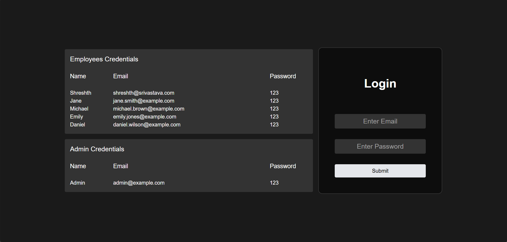
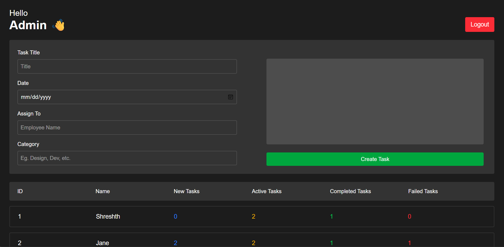
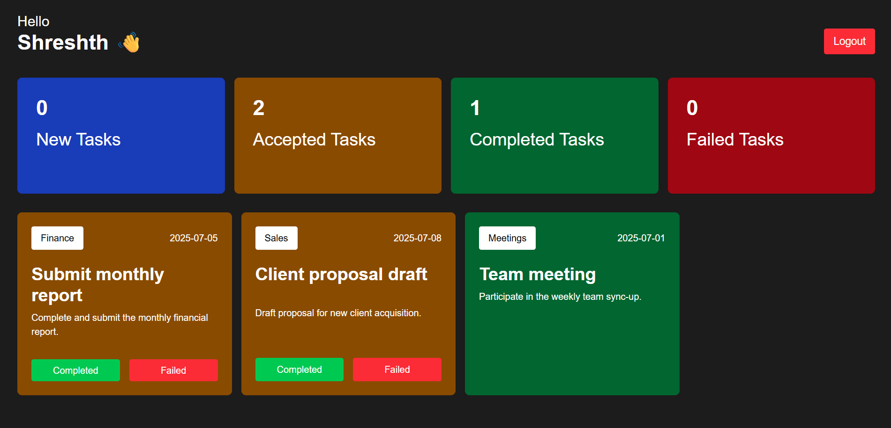

<!-- # Synapse - An Employee Management System Using ReactJS
## by Shreshth Srivastava -->

# Synapse 🧠

A full-featured **Employee Management System** built with React.js — featuring role-based dashboards, task management, and real-time data persistence via browser local storage.

---

## 📋 Table of Contents

- About the Project
- Features
- Tech Stack
- Getting Started
  - Prerequisites
  - Installation
- Usage
- Project Structure
- Screenshots
- License

---

## 📖 About the Project

**Synapse** is an Employee Management System designed to simplify workplace task coordination between admins and employees. It provides a clean, role-based interface where administrators can assign and track tasks, while employees can view and manage their assigned work — all without a backend server.

Data is persisted using **browser local storage**, simulating real backend interactions entirely on the front end.

---

## ✨ Features

- 🔐 **Role-Based Access** — Separate dashboards for Admin and Employee users
- 📝 **Task Assignment** — Admins can create, assign, and track tasks for employees
- 📊 **Real-Time Updates** — Changes reflect instantly across the UI
- 💾 **Local Storage Persistence** — All data is saved in the browser — no server required
- 🧩 **Component-Based Architecture** — Clean, reusable React components throughout
- 📱 **Responsive UI** — Works across different screen sizes

---

## 🛠 Tech Stack

| Technology | Purpose |
|---|---|
| [React.js](https://reactjs.org/) | Frontend framework |
| HTML5 / CSS3 / Tailwind CSS | Markup and styling |
| Browser Local Storage | Data persistence |

---

## 🚀 Getting Started

Follow these steps to run the project locally.

### Prerequisites

Make sure you have the following installed:

- [Node.js](https://nodejs.org/) (v14 or higher)
- npm or yarn
```bash
node -v
npm -v
```

### Installation

1. **Clone the repository**
```bash
git clone https://github.com/Shreshth-Srivastava/Synapse.git
```

2. **Navigate to the project directory**
```bash
cd synapse
```

3. **Install dependencies**
```bash
npm install
```

4. **Start the development server**
```bash
npm start
```

5. Open your browser and go to `http://localhost:5173`

---

## 🧭 Usage

### Admin Login
- Log in with admin credentials to access the **Admin Dashboard**

### Employee Login
- Log in with employee credentials to access the **Employee Dashboard**
- View assigned tasks, update task status, and track your workload

> **Default Credentials**
> Sample login credentials are available on the landing page of the app.

---

## 📁 Project Structure
```
synapse/
├── public/
│   └── index.html
├── src/
│   ├── assets/
│   │   └── react.svg
│   ├── components/
│   │   ├── Auth/
│   │   │   └── Login.jsx
│   │   ├── Dashboard/
│   │   │   ├── AdminDashboard.jsx
│   │   │   └── EmployeeDashboard.jsx
│   │   ├── TaskList/
│   │   │   └── TaskList.jsx
│   │   └── Utils/
│   │       ├── Header.jsx
│   │       └── MetricCard.jsx
│   ├── context/
│   │   └── AuthProvider.jsx
│   ├── utils/
│   │   └── LocalStorage.js
│   ├── App.css
│   ├── App.jsx
│   ├── index.css
│   └── main.jsx
├── package.json
└── README.md
```

---

## 📸 Screenshots

| Admin Dashboard | Employee Dashboard |
|---|---|---|
|  |  |  |

---

## 📄 License

Distributed under the MIT License. See [`LICENSE`](LICENSE) for more information.